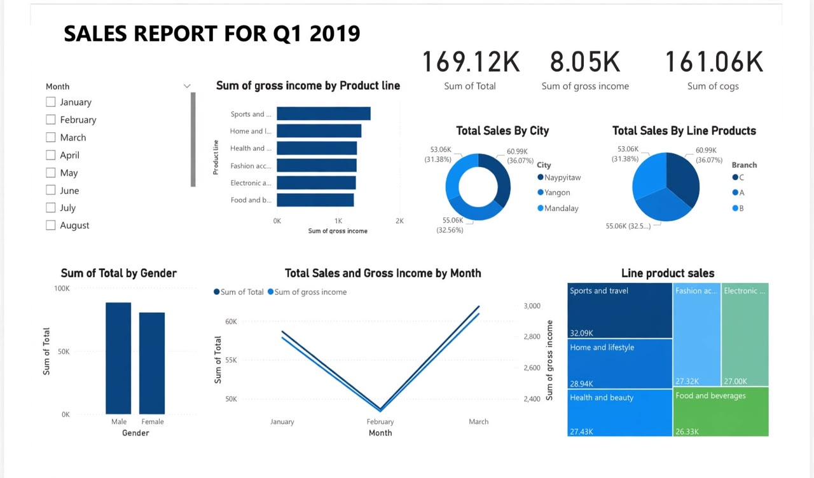

# 📊 Sales Report - Q1 2019 | Power BI Dashboard

## Overview
This Power BI dashboard analyzes sales performance for Q1 2019, providing insights into revenue, product performance, and customer behavior.

## 📈 KPIs
- **Total Sales:** 169.12K
- **Gross Income:** 8.05K  
- **Total COGS:** 161.06K

## 🔍 Key Insights
- Sales analysis by Product Line, City, and Gender
- Monthly sales trends and performance
- Customer type and payment method
